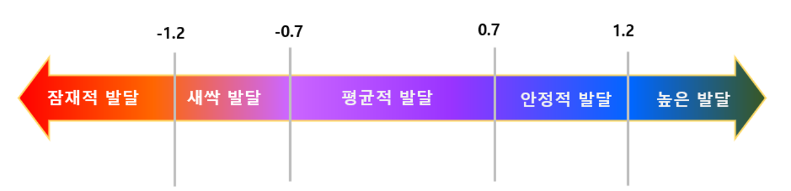

<h1>cREAte 상담보고서</h1>

 
 

<h2>Project Overview</h2>

상담 결과 내용을 보고서 페이지로 제작

개발기간: 2024.4.4 ~ 2024.4.29 

 
 

<h2>배포 주소</h2>

주소: https://developnehub.cafe24.com/report/login.html

 
 

<h2>시작 가이드</h2>

<h3>테스트 샘플 데이터</h3>

길동0000

 

<h3>기능 소개</h3>
<ol>
  <li>결과 요인 그래프 제시</li>
  <li>학생 데이터에 맞게 하위척도별 점수, 그래프, 설명 제시</li>
  <li>로그인, 로그아웃 로직 포함</li>
</ol>
 
 

<h2>Stacks</h2>
<h3>Environment</h3>

 

<h3>Development</h3>

 

<h3>Program Tools</h3>

Filezilla

 

<h3>Others</h3>

SessionStorage(for saving data temporarily and using in page)

SheetJs for analysis data

ChartJs for making barchart and radar-chart

 
 

<h2>유의사항</h2>

급하게 제작된 임시 사이트입니다. 주소에서도 볼 수 있듯이, shinhan_COPM_system 사이트 내 디렉토리에 만들어졌습니다..

